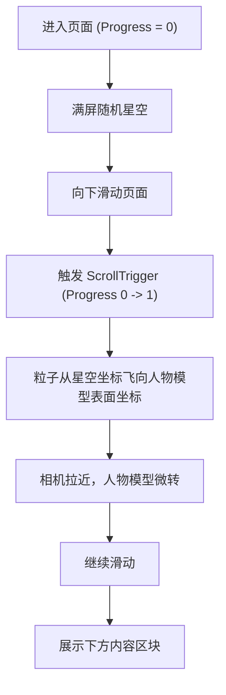

## 1. 产品概述
星空粒子聚合成人物形状的 WebGL 3D 互动落地页 (Landing Page)。
- 通过页面滚动（Scroll）触发三维空间中星空粒子到人物模型的平滑过渡（Morphing）效果，打造极具视觉冲击力的品牌展示体验。
- 为追求前沿视觉和互动体验的品牌或项目提供高质量的入口。

## 2. 核心功能

### 2.1 用户角色
| 角色 | 注册方式 | 核心权限 |
|------|----------|----------|
| 访客 | 无 | 浏览页面，体验 3D 滚动互动 |

### 2.2 功能模块
1. **Hero 首屏模块**：品牌展示，满屏随机分布的星空粒子背景。
2. **Morph 滚动过渡模块**：核心互动区，随着滚动，星星粒子从星空位置飞向 3D 人物模型表面，人物缓慢旋转，相机推进。
3. **内容模块**：人物成型后的后续图文内容展示。

### 2.3 页面详细说明
| 页面名称 | 模块名称 | 功能描述 |
|----------|----------|----------|
| 首页 | Hero 模块 | 满屏星空，品牌名居中或左侧展示。 |
| 首页 | 滚动互动区 | 高度约为 180vh，滚动时粒子进度从 0 变至 1，完成形变过渡。 |
| 首页 | 后续内容区 | 深色背景，展示后续文案或产品详情。 |

## 3. 核心流程
用户进入页面，看到满屏星空。向下滑动时，星星飞往人物模型，组合成人物，同时人物旋转、相机拉近。继续滑动，浏览下方常规内容。

## 4. 用户界面设计
### 4.1 设计风格
- 主副颜色：极致深色背景（如 `#02040a` 至 `#05070d`），白色/蓝白色星光。
- 字体与大小：现代无衬线字体（如 Inter 或 Helvetica），大号加粗排版。
- 布局风格：固定全屏 Canvas 作为底层，HTML 滚动内容在上层覆盖，Hero 居中或左对齐，保持极简呼吸感。

### 4.2 页面设计概览
| 页面名称 | 模块名称 | UI 元素与样式 |
|----------|----------|---------------|
| 首页 | Hero 模块 | 标题，极简，透明背景 |
| 首页 | Morph 区 | 无文字干扰，纯 3D 视觉展示区 |
| 首页 | 内容区 | 卡片、段落文本，与 3D 人物相得益彰 |

### 4.3 响应式
- 桌面端优先，移动端自适应。移动端自动降低粒子数量（例如从 30000 降至 12000）以保证性能。

### 4.4 3D 场景指引
- **环境与氛围**：深邃的宇宙星空感。
- **相机设置**：PerspectiveCamera，初始 z 轴较远（12），滚动拉近（7）。
- **动效与交互**：基于 GSAP ScrollTrigger，控制 Shader 中的 uProgress；包含 Shader 中的平滑过渡插值（mix）和噪声扰动。
- **材质与渲染**：定制 ShaderMaterial，带距离渐变圆点（alpha 处理），不写深度（depthWrite: false）。