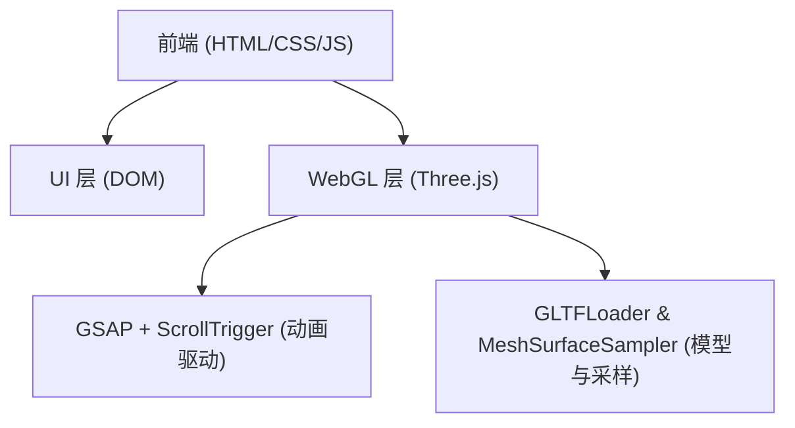

## 1. 架构设计

## 2. 技术说明
- 前端：Vite + 原生 JavaScript + HTML + CSS
- 核心 3D 库：Three.js
- 动画库：GSAP + ScrollTrigger
- 3D 扩展：GLTFLoader (加载模型), MeshSurfaceSampler (模型表面采样点)

## 3. 路由定义
单页面应用 (Landing Page)，无复杂路由。
| 路由 | 目的 |
|------|------|
| / | 展示 3D 星空聚合人物互动页面 |

## 4. 数据模型
本页面为纯视觉互动展示，不涉及复杂后台数据和数据库。只需加载静态的 `.glb` 人物模型文件。

## 5. 性能优化策略
- 采用 GPU Shader 进行大量粒子的位置插值计算（`mix()`），避免在 JS 主线程遍历数组。
- 使用 `BufferGeometry` 一次性传递起始坐标和目标坐标给 GPU。
- 针对移动端屏幕尺寸，动态减少 `particleCount`（例如小于 768px 时粒子数为 12000）。
- 不可见区域剔除或简单片元着色器处理。